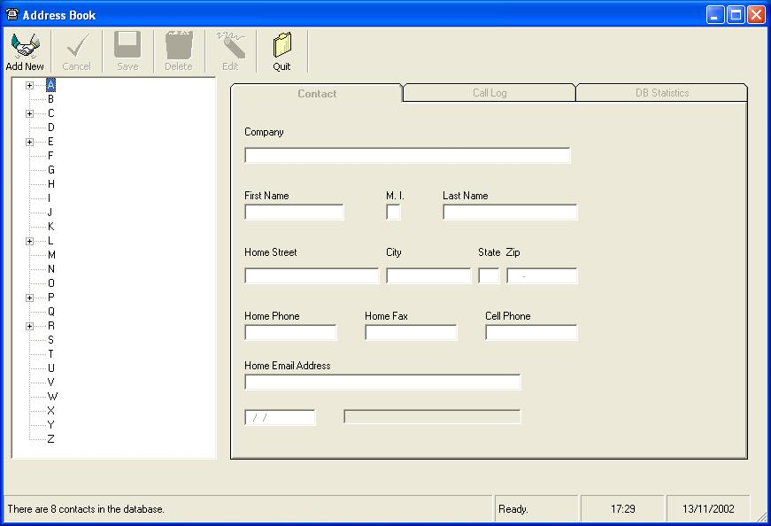



## YAAB Yet Another Address Book

### Description

Store name and address information with associated call logging. I use it to track calls to job agencies while I'm looking for contracts.
 
### More Info
 
Should be fairly easy to understand and modify.

             |
---                |---
**Submitted On**   |2002-11-12 09:34:42
**By**             |[John Russell](https://github.com/Planet-Source-Code/PSCIndex/blob/master/ByAuthor/john-russell.md)
**Level**          |Beginner
**User Rating**    |4.8 (24 globes from 5 users)
**Compatibility**  |VB 6\.0
**Category**       |[Databases/ Data Access/ DAO/ ADO](https://github.com/Planet-Source-Code/PSCIndex/blob/master/ByCategory/databases-data-access-dao-ado__1-6.md)
**World**          |[Visual Basic](https://github.com/Planet-Source-Code/PSCIndex/blob/master/ByWorld/visual-basic.md)
**Archive File**   |[YAAB\_Yet\_A14966911132002\.zip](https://github.com/Planet-Source-Code/john-russell-yaab-yet-another-address-book__1-40684/archive/master.zip)

